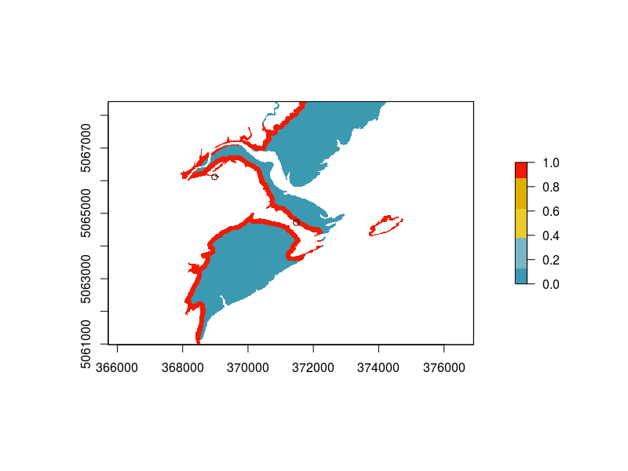
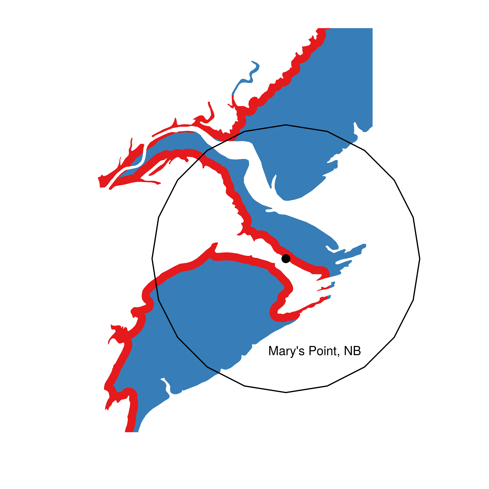

> Tick tock, tick tock


{: .full}

I've been a bit distracted with writing words in an actual document this week, but I got excited today when I found this piece [here](https://github.com/tidyverse/ggplot2/wiki/plotting-polygon-shapefiles) on plotting maps in `ggplot2`. I've used a raster to extract habitat information based on a cell's location in the past, but over the scale of Atlantic Canada, this is very time and CPU consuming. I needed to plot my results for an upcoming poster and wanted to redo an example map I'd used in a presentation before.

Here's the original made in base `R` with the raster:


Here's the code that made the new version

```r
library(sp)
library(rgdal)
library(rgeos)
library(maptools)
library(raster)
require(tidyverse)
require(cowplot)


### Ignore this, its just loding and setting up the data
source('prepareNewSiteData.r')

points.layer <- dat
fixR <- function(x, d=150) ifelse(is.na(x), x, ifelse(x>d, 0, 1))
fixA <- function(x) ifelse(!is.na(x), 1, x)
utm.proj <- paste0("+proj=utm +zone=", utm,  " +north +ellps=GRS80 +units=m +no_defs ", sep ="")
P.utm.utm <- readOGR("../GIS/",layer = paste0("UTM", utm, "Intertidal_dist" , sep ="")) %>%
spTransform(., CRS(utm.proj))
P.utm.utm$distanceD150 <- fixR(P.utm.utm$distance)
P.utm.utm$distanceA <- fixA(P.utm.utm$distance)

# Here's the key I didn't realize about fortifying my data
extent_r <- extent(matrix(c(367012.3,5061473,373081.6 ,5069023 ), nrow=2))
pointsPolygon@data <- as.data.frame(pointsPolygon@data)
buffg <- gBuffer(pointsPolygon,byid = T,width = 2500)
buffg@data$id = rownames(buffg@data)
buffg.points = fortify(buffg, region="id")
buffg.points.df = plyr::join(buffg.points, buffg@data, by="id")%>% filter(Locality=="Mary's Point")

P.utm.utm.crop <- crop(P.utm.utm, extent_r)
P.utm.utm.crop@data$id = rownames(P.utm.utm.crop@data)
P.utm.utm.crop.points = fortify(P.utm.utm.crop, region="id")
P.utm.utm.crop.df = plyr::join(P.utm.utm.crop.points, P.utm.utm.crop@data, by="id") %>%
  mutate(d150 = ifelse(distance == 150, "High", "Low"))

# Here's the easy ggplot. 

mapt_plt <- 
ggplot(P.utm.utm.crop.df) + 
  aes(long,lat,group=group,fill=as.factor(d150)) + 
  geom_polygon() +
  geom_polygon(data=buffg.points.df, aes(fill=NA), colour = 'black')+
  geom_point(data=points.layer.points, colour = 'black', 
             aes(x=x,y=y,group=NULL,fill=NULL), size=3)+
  coord_equal() +
  scale_fill_brewer(type='qual', palette = 'Set1', 
  	direction = 1,"Predation Danger") +
  theme(legend.position = 'None', axis.ticks = element_blank(),
        axis.text = element_blank(),
        axis.line = element_blank()) + labs(x="",y="") +
  annotate("text",372000, 5063000, label = "Mary's Point, NB" )

```

Here's the final map:



*Much nicer I think. And several hours faster*